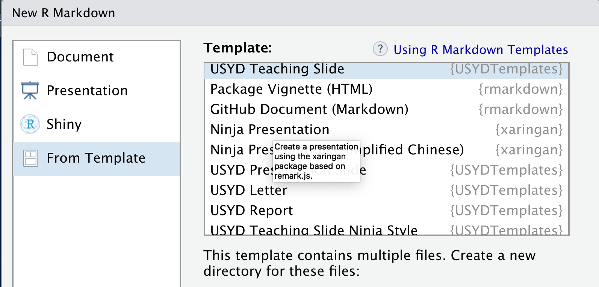

# USYD R Markdown Templates

This package provides Rmarkdown templates for use at the University of Sydney. 

It contains

 * USYD report template that can be used for consultation or as working paper,
 * USYD letter template, and
 * 3 USYD `xaringan` slides template: teaching, teaching with ninja style and presentation with ninja style.
 
 ## Installation

```r
# install.packages("devtools")
devtools::install_github('emitanaka/USYDTemplates')
```

## Use

Open RStudio > New File > R Markdown ... > From Template then you can select from various template that you wish.


